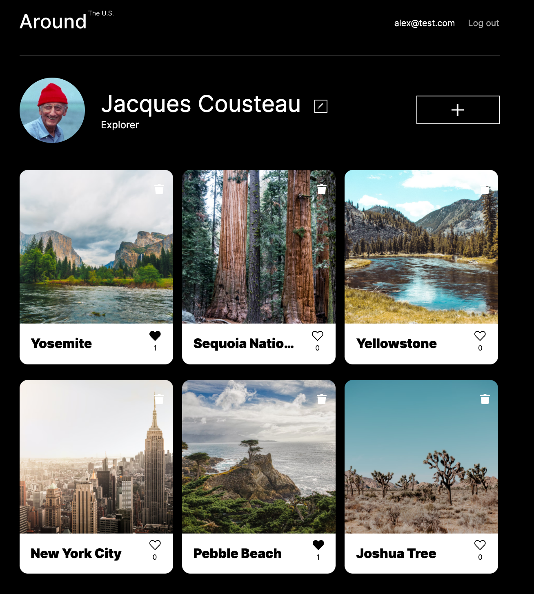

# Around the U.S. 

## About
My study project where you can upload your picturesque photos and share them with your friends.
Technology stack used: HTML, CSS, JS, MERN (Mongo, Express, React, Node.js). 

## Functionality
- User registration and authorization
- Uploading a new pictures with the API help and React forms
- Deleting your pictures
- Liking your pictures
- Updating profile information with the help of React forms

## Installation
- Download or clone repository
- Install npm dependencies using `npm i`
- Launch service in **development** mode using `npm run dev` or launch a **production build** using `npm run start`

## Deployed 

Front end is deployed on [Netlify](https://alex-around-us.netlify.app/ "Deployed on Netlify").

Back end is deployed on [Heroku](https://around-alex.herokuapp.com/ "Thanks God Heroku was created").

